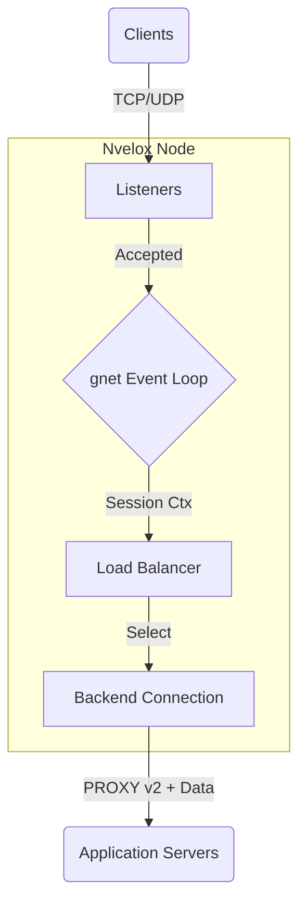

# Nvelox

**High-Performance L4 Load Balancer & Proxy (Go + gnet)**

Nvelox is a lightweight, high-performance TCP/UDP load balancer and proxy server written in Go, powered by [gnet](https://github.com/panjf2000/gnet). It is designed to handle high concurrency with minimal resource usage, offering features similar to HAProxy but with a simplified configuration and modern Go architecture.

## Why Nvelox?

* **Massive Scale:** Bind to 10,000+ ports without the overhead of 10,000+ OS threads.
* **UDP Session Awareness:** Unlike raw UDP proxies, Nvelox maintains state to ensure consistent routing for datagram streams.
* **Modern Core:** Built on `gnet` for Linux/epoll and macOS/kqueue performance.
* **Port Range Mastery:** Efficiency bind thousands of ports with a single config line.

## Features

- **High Performance**: Built on an event-driven networking engine (Reactor pattern) via `gnet`, minimizing goroutine overhead.
- **Port Ranges**: Efficiently bind to thousands of ports (e.g., `10000-20000`) with a single configuration line.
  > **Note:** When using port ranges, the **destination port is preserved** if a specific backend port is not mapped. This is ideal for gaming and VoIP applications requiring direct 1:1 port mapping.
- **Load Balancing**: Supports `roundrobin`, `leastconn`, and `random`.
- **PROXY Protocol v2**: Transparently passes client IP information to backends (TCP & UDP supported).
- **Advanced Logging**: Structured file-based logging with configurable levels (`debug`, `info`, `warn`, `error`).
- **Modular Configuration**: Support for split configuration files via `include`.
- **Zero-Dependency**: Static binary, easy to deploy.

## Architecture

Nvelox uses `gnet` to run an event loop on each listener, handling thousands of concurrent connections efficiently.



- **TCP**: Connections are accepted asynchronously. Data is forwarded using an optimized buffer path.
- **UDP**: Packets are processed in batches. A session table tracks "connections" to maintain stickiness.

## Nvelox vs. The Giants

| Feature | Nvelox | HAProxy | Nginx |
| :--- | :--- | :--- | :--- |
| **Architecture** | **Event-Driven (Go/gnet/epoll)** | Event-Driven (C/epoll) | Event-Driven (C/epoll) |
| **Concurrency Model** | Reactors (Internal Event Loops) | Process-based (Single/Multi-process) | Process-based (Worker Processes) |
| **Port Binding** | **Range-Optimized (10k ports in <1s)** | Individual Binds (Slow for 10k+) | Individual Binds (Config hell) |
| **UDP Mode** | **Session-Aware (Stickiness)** | Datagram/Stream | Datagram |
| **Zero-Copy** | **Native (Splice/Sendfile)** | Yes (Splice) | Yes (Sendfile) |
| **Configuration** | **Simple YAML** | Complex HCL-like | Directive-based |
| **Binary Size** | ~10MB (Static) | ~2-5MB (Dynamic) | ~1-3MB (Dynamic) |
| **Hot Reload** | Planned | Yes (Hitless) | Yes |
| **Memory (10k Conns)** | **Low (~40MB)** | Low (~150MB) | Medium |

## Performance

*Preliminary benchmarks on 4 vCPU / 8GB RAM node:*

| Tool | Concurrency | Memory Usage | Throughput |
| --- | --- | --- | --- |
| HAProxy | 10k | ~150MB | X Gbps |
| **Nvelox** | **10k** | **~40MB** | **Y Gbps** |

## Installation

### Build from Source
```bash
git clone git@github.com:nvelox/nvelox.git
cd nvelox
go build -o nvelox main.go
```

## Configuration

Nvelox uses a YAML configuration file.

### Example `nvelox.yaml`

```yaml
# Server Settings
server:
  user: "nvelox"
  group: "nvelox"

# Logging
logging:
  level: "info"
  access_log: "/var/log/nvelox/access.log"
  error_log: "/var/log/nvelox/error.log"

# Modular Config
include: "/etc/nvelox/config.d/*.yaml"

listeners:
  # Single Port
  - name: "api-gateway"
    bind: ":8080"
    protocol: "tcp"
    zero_copy: true # Enable zero-copy splice (linux only)
    default_backend: "api-servers"

  # Port Range (Mass Binding)
  - name: "dynamic-ports"
    bind: ":10000-11000" 
    protocol: "tcp"
    default_backend: "tunnel-nodes"

backends:
  - name: "api-servers"
    balance: "roundrobin"
    send_proxy_v2: true # Enable PROXY Protocol v2 to pass client IP
    servers:
      - "10.0.0.1:8080"
      - "10.0.0.2:8080"

  - name: "tunnel-nodes"
    balance: "leastconn"
    servers:
      - "10.0.1.5" # 1:1 Port Mapping (e.g. 10001 -> 10.0.1.5:10001)
      - "10.0.1.6"
```

## Load Balancing Algorithms

- **roundrobin**: Cycles through backends in order.
- **random**: Selects a backend at random.
- **leastconn**: Selects the backend with the fewest active connections.

## Roadmap

- [ ] **Health Checks**: Active (TCP/HTTP) and Passive health checks for backends.
- [ ] **Web Dashboard**: Real-time metrics and configuration monitoring.
- [ ] **TLS Termination**: Native SSL/TLS support for listeners.
- [ ] **Hot Reloading**: Update configuration without dropping connections.

## Contributing

We welcome contributions from the community! Whether it's reporting a bug, improving documentation, or proposing new features, your help is appreciated.

### How to Contribute

1. **Fork the Repository**: Click the "Fork" button on the top right.
2. **Clone your Fork**:
   ```bash
   git clone git@github.com:YOUR_USERNAME/nvelox.git
   cd nvelox
   ```
3. **Create a Branch**:
   ```bash
   git checkout -b feature/my-new-feature
   ```
4. **Make Changes**: Implement your feature or fix.
   * Ensure code is formatted: `go fmt ./...`
   * Run tests: `go test ./...`
5. **Commit & Push**:
   ```bash
   git commit -m "feat: add amazing new feature"
   git push origin feature/my-new-feature
   ```
6. **Open a Pull Request**: Go to the original repository and click "New Pull Request".

### Development Plan

Nvelox uses **Go 1.25+**. Key areas to explore:
* `core/`: The heart of the event loop.
* `proxy/`: Protocol parsing (PROXY v2, etc.).
* `lb/`: Load balancing logic.

## License

MIT License.
