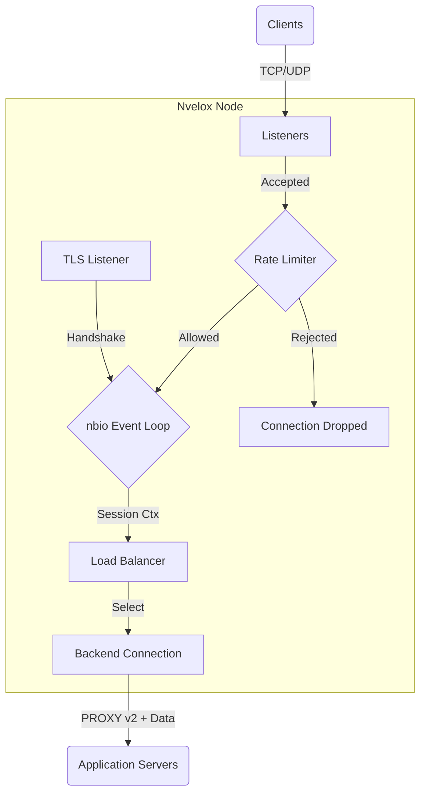

# Nvelox

**High-Performance L4 Load Balancer & Proxy (Go + nbio)**

Nvelox is a lightweight, high-performance TCP/UDP load balancer and proxy server written in Go, powered by [nbio](https://github.com/lesismal/nbio). It is designed to handle high concurrency with minimal resource usage, offering features similar to HAProxy but with a simplified configuration and modern Go architecture.

## Why Nvelox?

* **Massive Scale:** Bind to 10,000+ ports without the overhead of 10,000+ OS threads.
* **UDP Session Awareness:** Unlike raw UDP proxies, Nvelox maintains state to ensure consistent routing for datagram streams.
* **Modern Core:** Built on `nbio` for Linux/epoll and macOS/kqueue performance.
* **Port Range Mastery:** Efficiency bind thousands of ports with a single config line.

## Features

- **High Performance**: Built on an event-driven networking engine (Reactor pattern) via `nbio`, minimizing goroutine overhead.
- **Async Backend Dial**: TCP backend connections use `nbio.DialAsync` — no goroutine-per-connection overhead.
- **Port Ranges**: Efficiently bind to thousands of ports (e.g., `10000-20000`) with a single configuration line.
  > **Note:** When using port ranges, the **destination port is preserved** if a specific backend port is not mapped. This is ideal for gaming and VoIP applications requiring direct 1:1 port mapping.
- **Load Balancing**: Supports `roundrobin`, `leastconn`, and `random` with accurate connection tracking.
- **TLS Termination**: Native TLS support on any listener with cert/key configuration.
- **Rate Limiting**: Per-listener token bucket rate limiter to protect against connection floods.
- **PROXY Protocol v2**: Transparently passes client IP information to backends (TCP & UDP supported).
- **UDP Session Affinity**: Connection pool ensures packets from the same client route to the same backend with TTL-based cleanup.
- **HTTP/1.1 + HTTP/2 Reverse Proxy**: L7 reverse proxy with Host and path-prefix routing, header manipulation, and automatic HTTP/2 via ALPN.
- **HTTP/3 (QUIC)**: Native HTTP/3 support via quic-go with Alt-Svc header advertisement for client discovery.
- **WebSocket Proxying**: Transparent WebSocket upgrade detection and bidirectional relay.
- **Header Manipulation**: Add/set/remove headers on requests and responses, with automatic X-Forwarded-For, X-Real-IP, and X-Forwarded-Proto injection.
- **Config Validation**: Comprehensive validation at load time — server addresses, ports, health check durations, TLS files, and balance algorithms.
- **Advanced Logging**: Structured file-based logging with configurable levels (`debug`, `info`, `warn`, `error`).
- **Modular Configuration**: Support for split configuration files via `include`.
- **Zero-Dependency**: Static binary, easy to deploy.

## Architecture

Nvelox uses `nbio` to run an event loop on each listener, handling thousands of concurrent connections efficiently.


```mermaid
graph TD
    Client(Clients) -->|TCP/UDP| Listeners
    subgraph Nvelox Node
        Listeners -->|Accepted| RateLimit{Rate Limiter}
        RateLimit -->|Allowed| EventLoop{nbio Event Loop}
        RateLimit -->|Rejected| Drop[Connection Dropped]
        EventLoop -->|Session Ctx| LB[Load Balancer]
        LB -->|Select| BackendConn[Backend Connection]
        TLS[TLS Listener] -->|Handshake| EventLoop
    end
    BackendConn -->|PROXY v2 + Data| AppServers(Application Servers)
```

- **TCP**: Connections are accepted asynchronously. Backend connections use `nbio.DialAsync` for non-blocking dial — no goroutine-per-connection. Data is forwarded bidirectionally via the event loop.
- **UDP**: Packets are processed with session affinity. A connection pool maps each client to its backend, ensuring consistent routing with TTL-based cleanup.
- **TLS**: TLS listeners perform the handshake in a dedicated accept loop, then hand the decrypted connection to the main proxy path.

## Nvelox vs. The Giants

| Feature | Nvelox | HAProxy | Nginx |
| :--- | :--- | :--- | :--- |
| **Architecture** | **Event-Driven (Go/nbio/epoll)** | Event-Driven (C/epoll) | Event-Driven (C/epoll) |
| **Concurrency Model** | Reactors (Internal Event Loops) | Process-based (Single/Multi-process) | Process-based (Worker Processes) |
| **Port Binding** | **Range-Optimized (10k ports in <1s)** | Individual Binds (Slow for 10k+) | Individual Binds (Config hell) |
| **UDP Mode** | **Session-Aware (Pool + Affinity)** | Datagram/Stream | Datagram |
| **TLS Termination** | **Yes (crypto/tls)** | Yes (OpenSSL) | Yes (OpenSSL) |
| **Rate Limiting** | **Yes (Token Bucket)** | Yes (stick-tables) | Yes (limit_conn) |
| **Zero-Copy** | **Native (Splice/Sendfile)** | Yes (Splice) | Yes (Sendfile) |
| **Configuration** | **Simple YAML + Validation** | Complex HCL-like | Directive-based |
| **Binary Size** | ~10MB (Static) | ~2-5MB (Dynamic) | ~1-3MB (Dynamic) |
| **Hot Reload** | Planned | Yes (Hitless) | Yes |
| **Memory (10k Conns)** | **Low (~40MB)** | Low (~150MB) | Medium |

## Performance

*Preliminary benchmarks on 4 vCPU / 8GB RAM node:*

| Tool | Concurrency | Memory Usage | Throughput |
| --- | --- | --- | --- |
| HAProxy | 10k | ~150MB | X Gbps |
| **Nvelox** | **10k** | **~40MB** | **Y Gbps** |

## Installation

### Build from Source
```bash
git clone git@github.com:nvelox/nvelox.git
cd nvelox
go build -o nvelox main.go
```

## Configuration

Nvelox uses a YAML configuration file.

### Example `nvelox.yaml`

```yaml
version: "2"
# Server Settings
server:
  user: "nvelox"
  group: "nvelox"

# Logging
logging:
  level: "info"
  access_log: "/var/log/nvelox/access.log"
  error_log: "/var/log/nvelox/error.log"

# Modular Config
include: "/etc/nvelox/config.d/*.yaml"

listeners:
  # Single Port
  - name: "api-gateway"
    bind: ":8080"
    protocol: "tcp"
    zero_copy: true # Enable zero-copy splice (linux only)
    default_backend: "api-servers"
    rate_limit:
      connections_per_second: 100  # Max 100 new connections/sec
      burst: 50                    # Allow burst of 50

  # TLS-Terminated Listener
  - name: "api-secure"
    bind: ":8443"
    protocol: "tcp"
    default_backend: "api-servers"
    tls:
      cert: "/etc/ssl/certs/server.pem"
      key: "/etc/ssl/private/server.key"

  # Port Range (Mass Binding)
  - name: "dynamic-ports"
    bind: ":10000-11000" 
    protocol: "tcp"
    default_backend: "tunnel-nodes"

  # UDP with Session Affinity
  - name: "dns-proxy"
    bind: ":5353"
    protocol: "udp"
    default_backend: "dns-servers"

backends:
  - name: "api-servers"
    balance: "leastconn"  # Accurate connection tracking
    send_proxy_v2: true   # Enable PROXY Protocol v2 to pass client IP
    
    # Active Health Check
    health_check:
      active:
        type: "tcp"     # "tcp" or "http"
        interval: "5s"  # Check every 5 seconds
        timeout: "1s"   # Timeout after 1 second
        # path: "/health" # Required if type is "http"

    servers:
      - "10.0.0.1:8080"
      - "10.0.0.2:8080"

  - name: "tunnel-nodes"
    balance: "leastconn"
    servers:
      - "10.0.1.5" # 1:1 Port Mapping (e.g. 10001 -> 10.0.1.5:10001)
      - "10.0.1.6"

  - name: "dns-servers"
    balance: "random"
    servers:
      - "10.0.2.1:53"
      - "10.0.2.2:53"
```

### HTTP/HTTPS Listener with L7 Routing

```yaml
listeners:
  - name: "web-gateway"
    bind: ":443"
    protocol: "https"
    http3: true  # Enable QUIC/HTTP3
    tls:
      cert: "/etc/ssl/cert.pem"
      key: "/etc/ssl/key.pem"
    default_backend: "web-servers"
    headers:
      response_add:
        Strict-Transport-Security: "max-age=31536000"
    routes:
      - match:
          host: "api.example.com"
        backend: "api-servers"
      - match:
          path_prefix: "/static"
        backend: "cdn-servers"
      - match:
          host: "ws.example.com"
        backend: "websocket-servers"
```

## Load Balancing Algorithms

- **roundrobin**: Cycles through backends in order.
- **random**: Selects a backend at random.
- **leastconn**: Selects the backend with the fewest active connections.

## Roadmap

- [x] **Health Checks**: Active (TCP/HTTP) health checks for backends.
- [x] **TLS Termination**: Native SSL/TLS support for listeners.
- [x] **Rate Limiting**: Per-listener token bucket rate limiter.
- [x] **LeastConn Tracking**: Accurate connection counting for load balancing.
- [x] **Async Backend Dial**: Non-blocking TCP backend connections via nbio.
- [x] **UDP Connection Pooling**: Session affinity with TTL-based cleanup.
- [x] **Config Validation**: Comprehensive validation at load time.
- [x] **HTTP/1.1 + HTTP/2 Reverse Proxy**: L7 routing with Host/Path matching.
- [x] **HTTP/3 (QUIC)**: Native HTTP/3 via quic-go.
- [x] **WebSocket Proxying**: Transparent upgrade and relay.
- [x] **Header Manipulation**: Request/response header add/set/remove.
- [ ] **Passive Health Checks**: Failure-based backend marking.
- [ ] **Web Dashboard**: Real-time metrics and configuration monitoring.
- [ ] **Hot Reloading**: Update configuration without dropping connections.
- [ ] **Auto TLS**: Automatic certificate management (Let's Encrypt / ACME).

## Contributing

We welcome contributions from the community! Whether it's reporting a bug, improving documentation, or proposing new features, your help is appreciated.

### How to Contribute

1. **Fork the Repository**: Click the "Fork" button on the top right.
2. **Clone your Fork**:
   ```bash
   git clone git@github.com:YOUR_USERNAME/nvelox.git
   cd nvelox
   ```
3. **Create a Branch**:
   ```bash
   git checkout -b feature/my-new-feature
   ```
4. **Make Changes**: Implement your feature or fix.
   * Ensure code is formatted: `go fmt ./...`
   * Run tests: `go test ./...`
5. **Commit & Push**:
   ```bash
   git commit -m "feat: add amazing new feature"
   git push origin feature/my-new-feature
   ```
6. **Open a Pull Request**: Go to the original repository and click "New Pull Request".

### Development Plan

Nvelox uses **Go 1.25+**. Key areas to explore:
* `core/engine.go`: Engine orchestration, TLS listener setup, rate limiter init.
* `core/handler.go`: L4 connection handling, async dial, data forwarding.
* `core/httpproxy/`: L7 HTTP reverse proxy (router, server, WebSocket).
* `core/ratelimit.go`: Token bucket rate limiter.
* `core/udppool.go`: UDP session affinity pool.
* `config/`: YAML parsing and validation.
* `proxy/`: Protocol parsing (PROXY v2).
* `lb/`: Load balancing algorithms (roundrobin, leastconn, random).

## License

MIT License.
