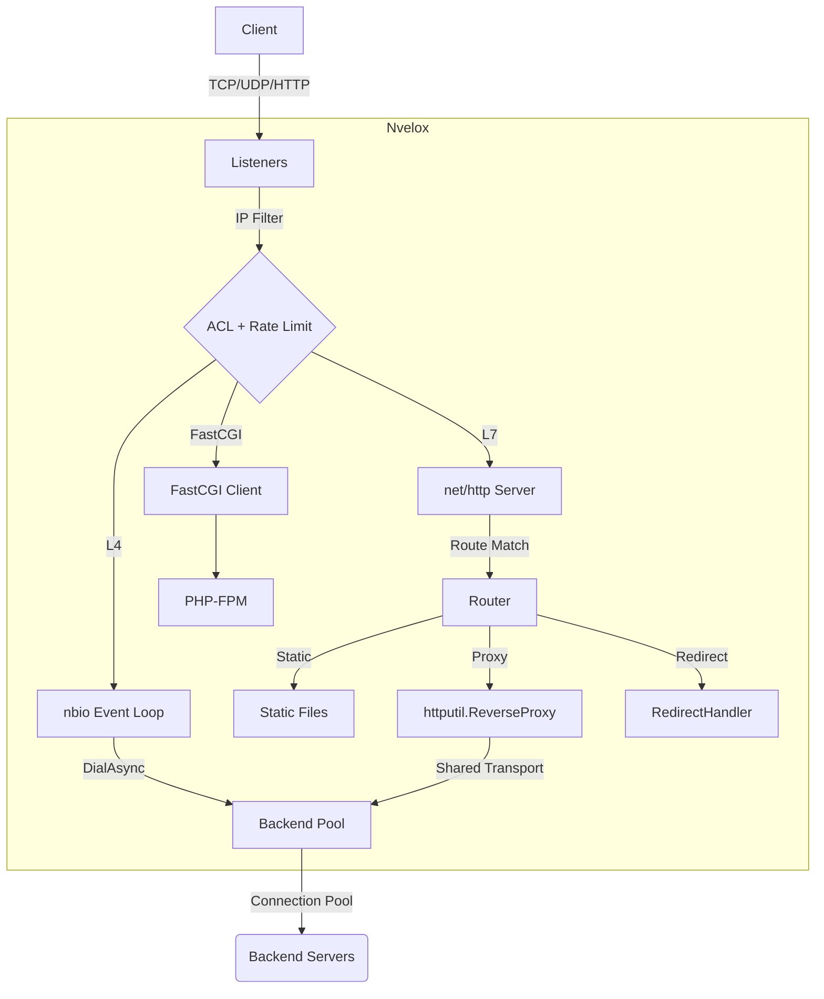

# Nvelox

**High-Performance L4/L7 Load Balancer, Reverse Proxy & Web Server (Go + nbio)**

Nvelox is a lightweight, high-performance load balancer and reverse proxy written in Go. It handles TCP/UDP (L4) and HTTP/HTTPS (L7) traffic with features comparable to nginx and HAProxy — in a single static binary with simple YAML configuration.

## Why Nvelox?

* **L4 + L7 in one binary** — TCP/UDP proxy, HTTP reverse proxy, static file server, FastCGI (PHP-FPM)
* **Massive Scale** — Bind 10,000+ ports with a single config line, event-driven via nbio
* **HTTP/1.1 + HTTP/2 + HTTP/3** — Full protocol support including QUIC
* **nginx-compatible features** — try_files, expires, FastCGI, regex routes, URL rewrite
* **Simple YAML config** — No complex directive syntax

## Features

### Core Proxy
- **L4 TCP/UDP Proxy** — async I/O via nbio with zero-copy splice support
- **L7 HTTP Reverse Proxy** — `httputil.ReverseProxy` with shared connection pool
- **HTTP/1.1 + HTTP/2** — automatic HTTP/2 via ALPN on HTTPS listeners
- **HTTP/3 (QUIC)** — via quic-go with Alt-Svc header advertisement
- **WebSocket Proxying** — transparent upgrade detection and bidirectional relay
- **Port Ranges** — bind `:10000-20000` with 1:1 port mapping for gaming/VoIP

### Load Balancing
- **Round Robin** — cycle through backends
- **Least Connections** — accurate per-connection tracking via OnConnect/OnDisconnect
- **Random** — random server selection
- **Sticky Sessions** — cookie, header, or IP-hash based session persistence
- **Connection Draining** — mark servers as draining (no new connections, existing continue)
- **Max Connections** — per-backend connection limit with 503 when full

### Routing (L7)
- **Multi-server-per-port** — multiple HTTPS sites share one bind address (nginx-style); each picks its own TLS cert via SNI and dispatches by Host header. `server_names` + `default_server` control matching, leftmost wildcards (`*.foo.com`) supported.
- **Host-based routing** — route by `Host` header (first-match-wins)
- **Path prefix routing** — route by URL path prefix
- **Regex routing** — regex path matching with capture groups
- **URL Rewriting** — `$1`-style substitution from regex captures
- **Redirect Rules** — 301/302 with variable substitution (`${host}`, `${path}`, `${uri}`, `${scheme}`, `${query}`, `${port}`)

### Static Files & PHP
- **Static File Serving** — serve from document root with directory index support
- **try_files** — nginx-style `$uri`, `$uri/`, `/fallback$is_args$args`
- **expires** — `1y`, `30d`, `1h`, `-1` (no-cache), sets Cache-Control/Expires headers
- **FastCGI (PHP-FPM)** — forward to PHP-FPM via TCP or Unix socket with `split_path_info`, custom params

### Security
- **TLS Termination** — on any TCP or HTTPS listener
- **OCSP Stapling** — automatic OCSP response fetching and refresh
- **Client Certificate Auth (mTLS)** — require/request client certs with CA verification
- **ACLs** — match by source IP/CIDR, HTTP method, headers; allow/deny actions
- **IP Allowlist/Denylist** — CIDR-based per-listener filtering
- **Per-IP Rate Limiting** — token bucket per client IP with LRU cleanup
- **Per-Listener Rate Limiting** — global connection rate limit
- **Request Body Size Limit** — reject oversized request bodies
- **SSL to Backend** — TLS when connecting to upstream servers (mTLS supported)

### Resilience
- **Active Health Checks** — TCP connect or HTTP GET with configurable interval/timeout
- **Passive Health Checks** — mark down after N consecutive failures
- **Retries / Failover** — retry on connect failure, 502, 503; skip failed servers
- **Circuit Breaker** — closed/open/half-open state machine per backend
- **Configurable Timeouts** — connect/read/write/idle per listener and backend
- **Graceful Drain** — finish in-flight connections on shutdown with configurable deadline

### Response Processing
- **Header Manipulation** — add/set/remove on request and response (per-listener and per-route)
- **X-Forwarded-For/X-Real-IP** — automatic proxy header injection
- **Gzip Compression** — configurable content types and minimum size
- **Response Caching** — in-memory cache with TTL, LRU eviction, Cache-Control support
- **Request/Response Buffering** — sync.Pool-based buffer pool for reverse proxy
- **Custom Error Pages** — styled HTML error pages (403, 404, 429, 502, 503, etc.)

### Observability & Management
- **Per-Request Access Logging** — method, path, status, bytes, latency, backend in CLF format
- **Prometheus Metrics** — `/metrics` endpoint with counters, gauges, histograms
- **Admin REST API** — runtime stats, drain/enable/disable servers
- **Hot Reload** — SIGHUP reloads config (backends and health checks)
- **Bandwidth Throttling** — per-connection read/write rate limiting

### Extensibility
- **Lua Scripting** — embedded Lua 5.1 VM with `nvelox.*` API for request/response hooks
- **PROXY Protocol v2** — pass client IP to backends in HAProxy format
- **DNS Service Discovery** — periodic hostname resolution with auto-update
- **SNI Routing** — TLS passthrough based on server name (wildcard support)
- **Modular Config** — split configs via `include` glob patterns
- **Config Validation** — comprehensive validation at load time

## Architecture


```mermaid
graph TD
    Client -->|TCP/UDP/HTTP| Listeners
    subgraph Nvelox
        Listeners -->|IP Filter| ACL{ACL + Rate Limit}
        ACL -->|L4| NBIOEngine[nbio Event Loop]
        ACL -->|L7| HTTPServer[net/http Server]
        ACL -->|FastCGI| FCGIClient[FastCGI Client]
        HTTPServer -->|Route Match| Router
        Router -->|Static| FileServer[Static Files]
        Router -->|Proxy| ReverseProxy[httputil.ReverseProxy]
        Router -->|Redirect| RedirectHandler
        NBIOEngine -->|DialAsync| BackendPool
        ReverseProxy -->|Shared Transport| BackendPool[Backend Pool]
        FCGIClient --> PHPFPM[PHP-FPM]
    end
    BackendPool -->|Connection Pool| Backends(Backend Servers)
```

## Nvelox vs. nginx vs. HAProxy

| Feature | Nvelox | HAProxy | Nginx |
| :--- | :--- | :--- | :--- |
| **L4 + L7** | Both | Both | Both |
| **HTTP/3** | Yes (quic-go) | Yes (quictls) | Yes (quic) |
| **FastCGI (PHP)** | Yes | No | Yes |
| **Static Files** | Yes | No | Yes |
| **try_files** | Yes | No | Yes |
| **Lua Scripting** | Yes | Yes (SPOE) | Yes |
| **Port Ranges** | `:10000-20000` | Individual | Individual |
| **Config Format** | YAML | Custom | Directives |
| **Binary** | Static (Go) | Dynamic (C) | Dynamic (C) |
| **Hot Reload** | SIGHUP | Hitless | SIGHUP |
| **Memory (10k)** | ~40MB | ~150MB | ~100MB |

## Quick Start

```bash
# Build
go build -o nvelox main.go

# Run with example config
./nvelox -config examples/01-basic-tcp-proxy.yaml

# See all 30 examples
cat examples/README.md
```

## Configuration

### Basic HTTP Proxy
```yaml
version: "2"
listeners:
  - name: "web"
    bind: ":80"
    protocol: "http"
    default_backend: "servers"
backends:
  - name: "servers"
    balance: "roundrobin"
    servers:
      - "10.0.0.1:8080"
      - "10.0.0.2:8080"
```

### HTTPS + HTTP/2 + Routing + Compression
```yaml
listeners:
  - name: "secure"
    bind: ":443"
    protocol: "https"
    tls:
      cert: "/etc/ssl/cert.pem"
      key: "/etc/ssl/key.pem"
    default_backend: "web"
    compression:
      enabled: true
    headers:
      response_add:
        Strict-Transport-Security: "max-age=31536000"
    routes:
      - match:
          host: "api.example.com"
        backend: "api"
      - match:
          path_prefix: "/static"
        static:
          root: "/var/www/html"
        expires: "1y"
```

### PHP-FPM with Static Files (nginx-equivalent)
```yaml
listeners:
  - name: "php-app"
    bind: ":80"
    protocol: "http"
    routes:
      - match:
          path_regex: "\\.(css|js|png|jpg|gif|ico)$"
        static:
          root: "/var/www/html"
        try_files:
          files: ["$uri"]
          fallback: "=404"
        expires: "1y"

      - match:
          path_regex: "\\.php(/|$)"
        fastcgi:
          pass: "127.0.0.1:9000"
          document_root: "/var/www/html"
          split_path_info: "^(.+\\.php)(/.*)$"

      - match:
          path_prefix: "/"
        static:
          root: "/var/www/html"
        try_files:
          files: ["$uri", "$uri/"]
          fallback: "/index.php$is_args$args"
        fastcgi:
          pass: "127.0.0.1:9000"
          document_root: "/var/www/html"
```

### Full Production (all features)
```yaml
version: "2"
metrics:
  enabled: true
  bind: ":9090"
admin:
  enabled: true
  bind: "127.0.0.1:9091"
logging:
  level: "info"
  access_log: "/var/log/nvelox/access.log"
  error_log: "/var/log/nvelox/error.log"

listeners:
  - name: "https"
    bind: ":443"
    protocol: "https"
    http3: true
    tls:
      cert: "/etc/ssl/cert.pem"
      key: "/etc/ssl/key.pem"
    default_backend: "web"
    compression: { enabled: true }
    ip_rate_limit: { requests_per_second: 100, burst: 50 }
    routes:
      - match: { host: "api.example.com" }
        backend: "api"

  - name: "http-redirect"
    bind: ":80"
    protocol: "http"
    routes:
      - match: { path_prefix: "/" }
        redirect: { url: "https://${host}${uri}", code: 301 }

backends:
  - name: "web"
    balance: "roundrobin"
    max_connections: 200
    retry: { attempts: 2, on: "connect_failure,502" }
    sticky_session: { type: "cookie", cookie_name: "SRV", ttl: "1h" }
    health_check:
      active: { type: "http", path: "/health", interval: "5s", timeout: "2s" }
      passive: { max_fails: 3 }
    circuit_breaker: { enabled: true, threshold: 5, timeout: "30s" }
    servers:
      - "10.0.0.1:8080"
      - "10.0.0.2:8080"

  - name: "api"
    balance: "leastconn"
    timeouts: { connect: "2s", read: "10s" }
    servers:
      - "10.0.1.1:8080"
```

## Examples

See [`examples/`](examples/) for 30 ready-to-run configs with test commands:

| # | Feature | Config |
|---|---------|--------|
| 01 | Basic TCP proxy | `01-basic-tcp-proxy.yaml` |
| 02 | Load balancing | `02-load-balancing.yaml` |
| 03 | Health checks | `03-health-checks.yaml` |
| 04 | Rate limiting | `04-rate-limiting.yaml` |
| 05 | TLS termination | `05-tls-termination.yaml` |
| 06 | HTTPS + HTTP/2 | `06-https-http2.yaml` |
| 07 | HTTP/3 QUIC | `07-http3-quic.yaml` |
| 08 | Host routing | `08-host-routing.yaml` |
| 09 | Path routing | `09-path-routing.yaml` |
| 10 | Regex + rewrite | `10-regex-rewrite.yaml` |
| 11 | Redirects | `11-redirects.yaml` |
| 12 | Header manipulation | `12-header-manipulation.yaml` |
| 13 | Compression | `13-compression.yaml` |
| 14 | Retries / failover | `14-retries-failover.yaml` |
| 15 | Sticky sessions | `15-sticky-sessions.yaml` |
| 16 | Max connections | `16-max-connections.yaml` |
| 17 | ACL access control | `17-acl-access-control.yaml` |
| 18 | IP allowlist/denylist | `18-ip-allowlist-denylist.yaml` |
| 19 | Body size limit | `19-body-size-limit.yaml` |
| 20 | Circuit breaker | `20-circuit-breaker.yaml` |
| 21 | Prometheus metrics | `21-metrics-prometheus.yaml` |
| 22 | Admin API | `22-admin-api.yaml` |
| 23 | Timeouts | `23-timeouts.yaml` |
| 24 | Caching | `24-caching.yaml` |
| 25 | Port range | `25-port-range.yaml` |
| 26 | PROXY protocol | `26-proxy-protocol.yaml` |
| 27 | UDP proxy | `27-udp-proxy.yaml` |
| 28 | Full production | `28-full-production.yaml` |
| 29 | Static files + try_files | `29-static-files.yaml` |
| 30 | PHP-FPM FastCGI | `30-php-fpm-fastcgi.yaml` |

## Testing

```bash
go test ./...                    # All tests (22 packages)
go test -race ./...              # Race detector
go test -v ./integration/...     # Integration tests
go test -coverprofile=c.out ./... && go tool cover -html=c.out  # Coverage
```

See [`examples/README.md`](examples/README.md) for manual real-world testing with curl.

## Project Structure

```
core/
  engine.go          — Engine orchestration, lifecycle
  handler.go         — L4 proxy (TCP/UDP via nbio)
  httpproxy/
    server.go        — L7 HTTP reverse proxy
    router.go        — Route matching (host/path/regex)
    static.go        — Static files, try_files, expires
    fastcgi.go       — FastCGI client (PHP-FPM)
    compress.go      — Gzip compression
    cache.go         — Response caching
    errorhtml/       — Styled error pages
  acl/               — Access control lists
  admin/             — Admin REST API
  circuitbreaker/    — Circuit breaker state machine
  discovery/         — DNS service discovery
  health/            — Active health checks
  metrics/           — Prometheus metrics
  middleware/        — Per-IP rate limiting
  scripting/         — Lua VM pool
  sni/               — SNI-based TLS routing
  sticky/            — Sticky session store
  throttle/          — Bandwidth throttling
  tlsutil/           — OCSP, client cert auth
config/              — YAML config parsing + validation
lb/                  — Load balancing algorithms
proxy/               — PROXY Protocol v2
```

## License

MIT License.
