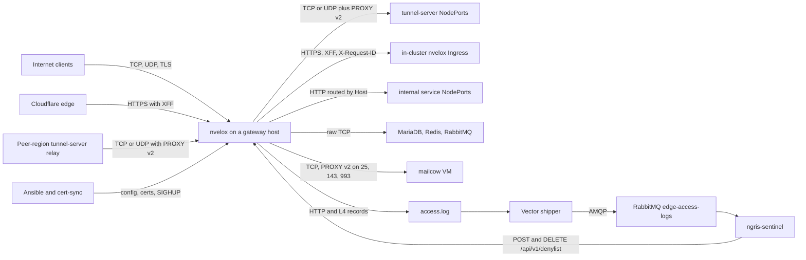
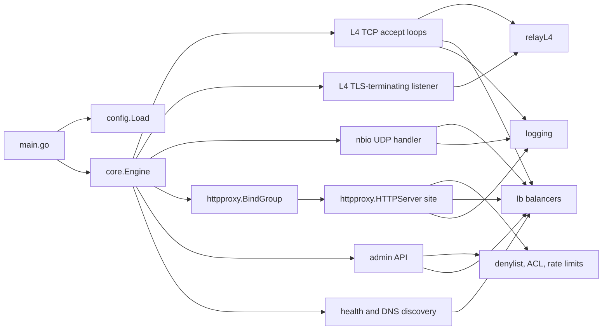
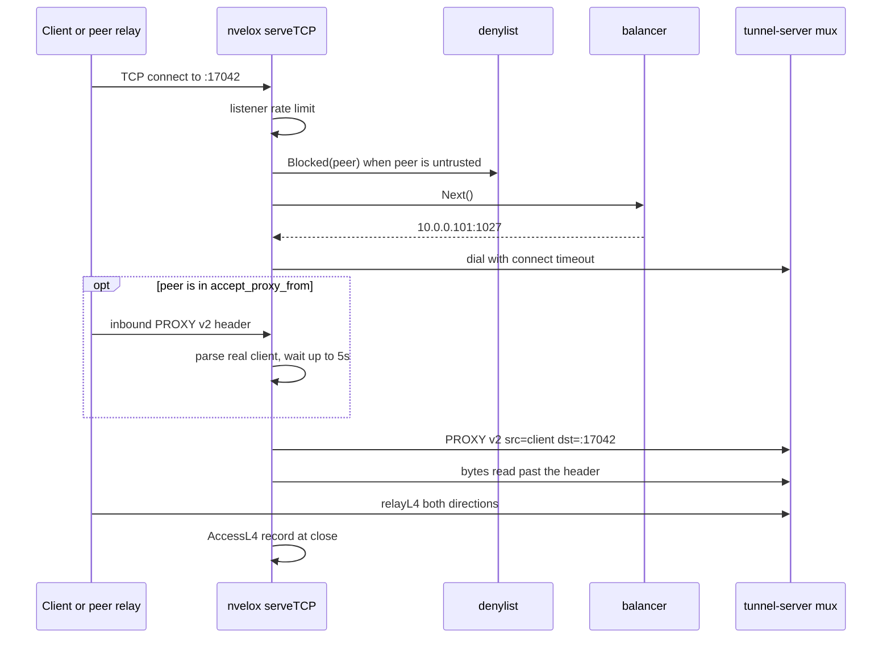
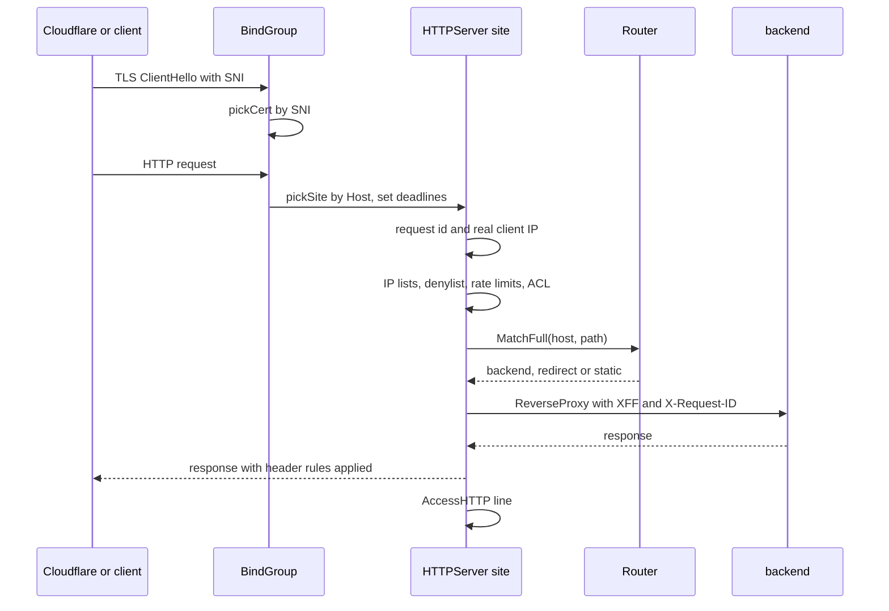
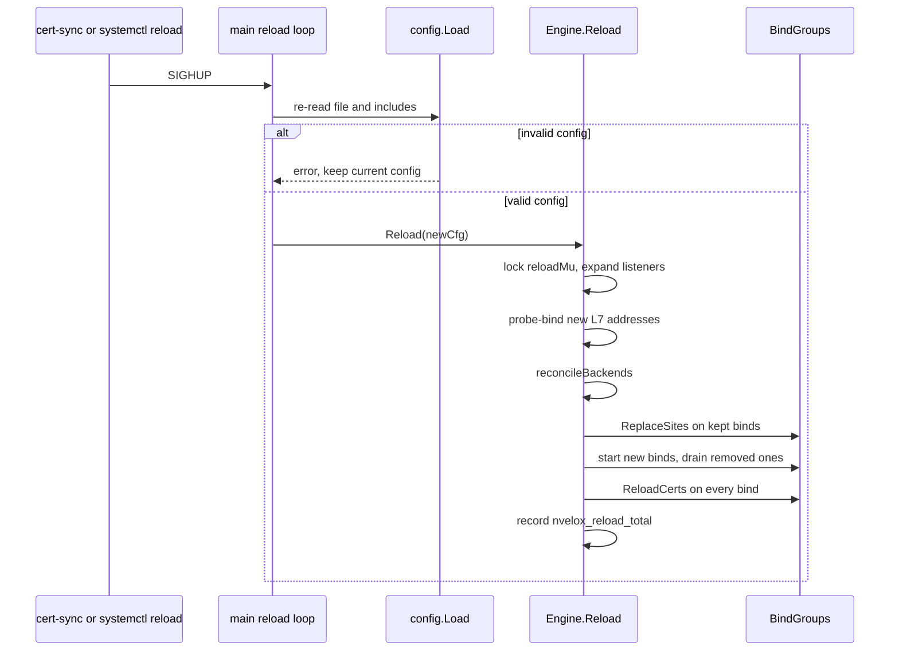
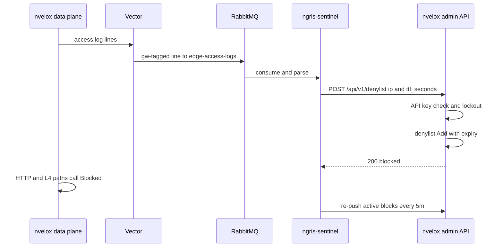

# nvelox architecture

nvelox is a single-binary L4/L7 proxy and load balancer written in Go. It listens on TCP, UDP, HTTP and HTTPS ports (plus optional HTTP/3), forwards each connection or request to a backend pool, and adds PROXY protocol v2, TLS termination, Host/SNI and path routing, ACLs, rate limits and a runtime IP denylist. In ngris it runs as a systemd service on the gateway hosts in front of the Kubernetes clusters: the public gateway (web sites and mail), the tunnel gateways (raw tunnel traffic into tunnel-server, one per region) and the internal gateway (`*.ngris.lan` services and data stores). ngris-sentinel reads its access log and pushes IP blocks back into it.

## At a glance

| | |
|---|---|
| Role | L4/L7 reverse proxy for ngris's gateway hosts and the in-cluster Ingress data plane |
| Language / runtime | Go 1.25 (`go.mod:3`), one static binary built with `CGO_ENABLED=0` (`Dockerfile:18`, `.goreleaser.yaml:6-7`) |
| Entrypoint | `main.go:25`: parse `-config`, `config.Load`, start `core.Engine`, handle SIGHUP (`main.go:39-104`) |
| Listeners | Declared in config: `tcp`, `udp`, `http`, `https`, single port or range (`config/config.go:103-195`, `core/engine.go:588-655`). HTTP/3 over QUIC on `https` binds with `http3: true` (`core/httpproxy/bindgroup.go:358-379`). Admin REST API on `admin.bind` (`core/admin/api.go:61-86`), Prometheus text on `metrics.bind` (`core/engine.go:150-168`) |
| How ngris runs it | systemd unit on 5 gateway hosts (`tf-infra/ansible/inventory/prod/hosts.ini:32-40`, `tf-infra/ansible/inventory/prod/hosts.ini:63-69`), built from source by the `nvelox` Ansible role (`tf-infra/ansible/roles/nvelox/tasks/main.yml:80-136`). One process per host, no replicas, no Helm chart. The in-cluster Ingress controller runs it as a sidecar, image `ghcr.io/nvelox/nvelox:v1.0.4` by default (`nvelox-ingress-controller/deploy/helm/nvelox-ingress-controller/values.yaml:84-87`) |
| State | In memory only: runtime denylist, balancer and health status, sticky sessions, UDP sessions, rate-limit buckets, response cache. Nothing is persisted |
| Main dependencies | `lesismal/nbio` (UDP event loop), `pires/go-proxyproto`, `quic-go/quic-go`, `yookoala/gofast` (FastCGI), `gopkg.in/yaml.v3` (`go.mod:5-12`). No database, Redis or queue client |

## Context

- **Clients and Cloudflare.** Public HTTPS sites trust Cloudflare's ranges as `trusted_proxies`, so the real client comes from `X-Forwarded-For` (`tf-infra/ansible/inventory/prod/group_vars/public-gw/listeners.yaml:172-182`, `core/httpproxy/server.go:919-950`).
- **Peer-region relays.** Tunnel listeners accept an inbound PROXY v2 header only from the edge egress IPs in `nvelox_cross_region_peer_cidrs` (`tf-infra/ansible/inventory/prod/group_vars/gateways/nvelox.yaml:36`, `core/proxytrust.go:28-50`).
- **tunnel-server.** The tunnel gateways forward to tunnel-server NodePorts 1024-1029 with `send_proxy_v2: true` (`tf-infra/ansible/inventory/prod/group_vars/ngris-tunnel-gw/backends.yaml:1-62`, `deploy/helm/tunnel-server/values.yaml:78-83`). tunnel-server wraps its listeners in a PROXY-protocol reader (`tunnel-server/tunnel/server.go:2105-2113`, `deploy/helm/tunnel-server/values.yaml:293`) and demuxes its TCP and UDP mux sockets by the header's destination port (`tunnel-server/tunnel/tcp_mux_listener.go:75-85`, `tunnel-server/tunnel/udp_mux_listener.go:174-178`).
- **In-cluster Ingress.** public-gw sends most of its web sites to port 16322 on the three k8s nodes over TLS with verification off (`tf-infra/ansible/inventory/prod/group_vars/public-gw/backends.yaml:9-17`). That port is the in-cluster nvelox Ingress, and plain-HTTP Ingresses use 4115 (`tf-infra/ansible/inventory/prod/group_vars/internal-gw/backends.yaml:157-161`).
- **Data stores and services.** internal-gw exposes RabbitMQ, Redis and MariaDB as plain L4 forwards, and `*.ngris.lan` HTTP services by Host (`tf-infra/ansible/inventory/prod/group_vars/internal-gw/listeners.yaml:20-62`, `tf-infra/ansible/inventory/prod/group_vars/internal-gw/listeners.yaml:78-209`).
- **Mail.** Mail ports go to the mailcow VM as L4, with PROXY v2 only where mailcow expects it (`tf-infra/ansible/inventory/prod/group_vars/public-gw/backends.yaml:108-130`).
- **Log feed.** Vector tails `/var/log/nvelox/access.log`, prefixes `gw=<host>`, and publishes to the `edge-access-logs` queue. It reaches RabbitMQ through internal-gw's `:1111` listener (`tf-infra/ansible/roles/vector/templates/vector.yaml.j2:30-38`, `tf-infra/ansible/roles/vector/templates/vector.yaml.j2:74-78`, `tf-infra/ansible/inventory/prod/group_vars/gateways/vector.yaml:20-33`).
- **ngris-sentinel.** It parses the HTTP and L4 lines (`ngris-sentinel/worker/parser.go:103-157`) and pushes blocks to the admin API of every configured gateway (`ngris-sentinel/worker/enforce.go:43-92`, `deploy/helm/ngris-sentinel/values.yaml:302`).
- **Ansible and cert-sync.** Ansible renders the config and restarts or reloads the service (`tf-infra/ansible/roles/nvelox/tasks/main.yml:180-222`). cert-sync installs renewed certs and sends SIGHUP (`tf-infra/ansible/inventory/prod/group_vars/public-gw/cert_sync.yaml:34-35`).

### The three gateways in ngris

| Gateway | Hosts | What nvelox does there |
|---|---|---|
| public-gw | `10.0.0.140` (`tf-infra/ansible/inventory/prod/hosts.ini:39-40`) | `:80` redirects every request to HTTPS (`tf-infra/ansible/inventory/prod/group_vars/public-gw/listeners.yaml:89-104`). `:443` terminates TLS for 14 sites chosen by SNI and Host. Three only redirect. The 11 proxied sites carry ACLs that return 404 for `/internal` and `/metrics`, and four of them also limit `/admin` to the VPN subnet (`tf-infra/ansible/inventory/prod/group_vars/public-gw/listeners.yaml:15-62`, `tf-infra/ansible/inventory/prod/group_vars/public-gw/listeners.yaml:106-350`). `X-Request-ID` is on with `trust_inbound: false`, so an inbound id is kept only when it arrives through a trusted proxy such as Cloudflare, and is minted otherwise (`tf-infra/ansible/inventory/prod/group_vars/public-gw/listeners.yaml:74-76`, `core/httpproxy/requestid.go:69-85`). L4 mail ports 25, 465, 587, 143 and 993 (`tf-infra/ansible/inventory/prod/group_vars/public-gw/listeners.yaml:360-379`). Admin API on 10.0.0.140 port 9091, pinned to release `v1.1.1` (`tf-infra/ansible/inventory/prod/group_vars/public-gw/nvelox.yaml:13-22`) |
| tunnel gateways | `ngris-unigate-eu-fin` in FIN, plus regional edges `ngris-unigate-us-east-va` and `ngris-unigate-de-central` (`tf-infra/ansible/inventory/prod/hosts.ini:32-33`, `tf-infra/ansible/inventory/prod/hosts.ini:63-69`) | L4 only. TCP `:80`, `:84`, `:443`, `:7443` and the range `:17000-17100`, and UDP `:443` and `:17000-17100`, all to tunnel-server with PROXY v2 (`tf-infra/ansible/inventory/prod/group_vars/ngris-tunnel-gw/listeners.yaml:9-60`). TLS passes through untouched, and tunnel-server terminates it. The ranges funnel to one mux port per protocol (`tf-infra/ansible/inventory/prod/group_vars/ngris-tunnel-gw/backends.yaml:44-62`). The edges forward to `127.0.0.1` on their single-node cluster (`tf-infra/ansible/inventory/prod/hosts.ini:54`) and add `:1030` (`tf-infra/ansible/inventory/prod/group_vars/k8s-edges-tunnel-gw/backends.yaml:1-54`, `tf-infra/ansible/inventory/prod/group_vars/k8s-edges-tunnel-gw/listeners.yaml:46-51`). The admin API listens on 10.0.0.130 port 9091 or the edge's WireGuard IP (`tf-infra/ansible/inventory/prod/group_vars/ngris-tunnel-gw/nvelox.yaml:14-17`, `tf-infra/ansible/inventory/prod/group_vars/k8s-edges-tunnel-gw/nvelox.yaml:16-19`) |
| internal-gw | `10.0.0.131` (`tf-infra/ansible/inventory/prod/hosts.ini:36-37`) | L4 forwards for RabbitMQ `:1111`, Redis `:6379`, MariaDB `:3306`, and tunnel-server `:1024`, `:1027` and `:1030` (TCP and UDP) (`tf-infra/ansible/inventory/prod/group_vars/internal-gw/listeners.yaml:20-63`). L7 `:80` routes 15 `*.ngris.lan` hosts by Host, trusting the pod CIDR and node IPs as proxies and keeping inbound `X-Request-ID` (`tf-infra/ansible/inventory/prod/group_vars/internal-gw/listeners.yaml:14-16`, `tf-infra/ansible/inventory/prod/group_vars/internal-gw/listeners.yaml:78-209`, `tf-infra/ansible/inventory/prod/group_vars/all/k8s.yml:26`). No admin API |

None of the gateway backends configure health checks, circuit breakers, sticky sessions or connection limits. The role's backend template cannot render them (`tf-infra/ansible/roles/nvelox/templates/nvelox-backends.yaml.j2:1-44`).

## Inside

| Package | Responsibility | Key files |
|---|---|---|
| `main` | Flags, config load, logger init, gateway id, engine start, SIGHUP loop | `main.go:39-122` |
| `config` | YAML schema, `include:` merge, defaults, validation | `config/config.go:516-585`, `config/config.go:587-767`, `config/config.go:800-898` |
| `core` (engine) | Builds backends, opens every listener, reload, graceful stop | `core/engine.go:112-357`, `core/engine.go:366-573`, `core/engine.go:712-858` |
| `core` (L4) | TCP accept loops, TLS L4, half-close relay, UDP handler, PROXY trust, UDP session pool, listener rate limiter | `core/l4tcp.go:42-247`, `core/relay.go:16-258`, `core/handler.go:101-501`, `core/proxytrust.go:28-149`, `core/udppool.go:12-138`, `core/ratelimit.go:9-50` |
| `core/httpproxy` | One socket per bind address with SNI cert and Host site selection, then the per-site request pipeline: router, request id, cache, compression, static files, FastCGI | `core/httpproxy/bindgroup.go:20-613`, `core/httpproxy/server.go:387-789`, `core/httpproxy/router.go:86-131`, `core/httpproxy/requestid.go:69-85` |
| `lb` | `roundrobin` (default), `leastconn` and `random` over the healthy set | `lb/lb.go:16-45` |
| `core/health`, `core/discovery` | Active TCP or HTTP probes. DNS re-resolve that drops private IPs unless `allow_private_ips` is set | `core/health/checker.go:36-131`, `core/discovery/dns.go:87-145` |
| `core/denylist` | Process-wide IP and CIDR denylist with TTL | `core/denylist/denylist.go:28-228` |
| `core/admin` | REST API: stats, backends, drain or enable or disable, denylist | `core/admin/api.go:61-325` |
| `core/acl`, `core/middleware` | ACL rules, CIDR lists, per-IP token buckets | `core/acl/acl.go:28-197`, `core/middleware/ipratelimit.go:24-138` |
| `core/circuitbreaker`, `core/sticky`, `core/passivehealth.go`, `core/connlimit.go` | Per-backend breaker, sticky store, passive failure counting, concurrency cap. Used on the HTTP path only | `core/httpproxy/server.go:595-611`, `core/httpproxy/server.go:696-750` |
| `core/logging` | Error log, HTTP and L4 access-log formats | `core/logging/logger.go:95-271` |
| `core/metrics` | Small Prometheus text registry | `core/metrics/metrics.go:19-197` |
| `core/tlsutil` | TLS version and cipher policy, SNI wildcard matching | `core/tlsutil/clientauth.go:105-128`, `core/tlsutil/sni.go:13-94` |
| `proxy` | PROXY v2 header writer for UDP datagrams | `proxy/proxy_protocol.go:26-105` |

Present but not wired into the engine: `core/sni` (SNI passthrough router), `core/throttle`, `core/scripting` (Lua), `core/tlsutil/ocsp.go` and `ConfigureClientAuth` (`core/tlsutil/clientauth.go:14`). No non-test code imports these packages or calls these functions. The matching config keys are accepted and ignored (see Configuration).

### Concurrency model

| Plane | Model | Code |
|---|---|---|
| Plain L4 TCP | One `net.Listen` and one accept goroutine per (expanded) listener. One goroutine per connection, plus one more inside `relayL4` for the second direction. Blocking copies with pooled 16 KiB buffers give real back-pressure. Accept errors back off from 5 ms to 1 s | `core/engine.go:226-245`, `core/l4tcp.go:42-70`, `core/relay.go:45-50`, `core/relay.go:88-101` |
| L4 TLS termination | `tcp` listener with `tls.cert`: `tls.Listen`, optionally wrapped by `proxyproto.Listener`. Same accept loop and relay | `core/engine.go:931-976`, `core/engine.go:978-1047` |
| UDP | nbio event loop with `OnOpen`, `OnData` and `OnClose` callbacks. One goroutine per backend session reads replies. Sessions are kept in a mutex-guarded pool | `core/engine.go:254-272`, `core/handler.go:101-169`, `core/handler.go:424-500` |
| HTTP, HTTPS, HTTP/3 | Go `net/http` server per bind address (a goroutine per connection) and an optional `quic-go` server. Site set and certificates live behind `atomic.Pointer`, so requests never take a lock to find their site | `core/httpproxy/bindgroup.go:20-41`, `core/httpproxy/bindgroup.go:323-400` |
| Background | Per-backend health checker and DNS resolver, sticky, cache and per-IP limiter cleanup loops, denylist sweeper (1 min), UDP pool sweeper (30 s) | `core/engine.go:712-776`, `core/engine.go:147`, `core/udppool.go:106-118` |
| Reload and shutdown | `reloadMu` serialises SIGHUP reloads and is held through `Start` until listeners are up. Shutdown closes listeners, waits for accept loops, closes live L4 conns, then waits up to 30 s for `ActiveConns` | `core/engine.go:112-127`, `core/engine.go:276-340` |

## Key flows

### TCP connection proxied with PROXY v2 (tunnel gateway)

- The listener rate limiter runs first. The dynamic denylist is checked only when the immediate peer is the client, because a trusted relay's own IP is infrastructure (`core/l4tcp.go:106-121`, `core/handler.go:172-184`).
- A server entry without a port gets the listener's port. The dial timeout is the backend's `timeouts.connect`, else the listener's, else 10 s (`core/l4tcp.go:146-172`, `config/config.go:362-371`).
- For a trusted peer, nvelox reads the inbound v2 header off the stream (at most 5 s and 1 MiB) and forwards any payload read past it. A LOCAL, malformed or missing header falls back to the peer address (`core/l4tcp.go:25-29`, `core/l4tcp.go:174-182`, `core/l4tcp.go:221-247`, `core/proxytrust.go:96-128`).
- The outbound header's destination is the address the client dialed, not nvelox's ephemeral source. That lets tunnel-server serve the whole `:17000-17100` range on one socket and demux by destination port (`core/l4tcp.go:184-197`, `tunnel-server/tunnel/tcp_mux_listener.go:75-85`).
- `relayL4` forwards everything already read before half-closing the other side (TCP `CloseWrite`, or `close_notify` plus FIN for TLS). Only an RST, a failed write or the idle timeout (default 5 min) aborts both sides (`core/relay.go:16-41`, `core/relay.go:54-62`, `core/relay.go:108-131`, `core/relay.go:188-194`).
- At close one L4 record is written: `ok` or `no_route`. Byte counts are always 0. No record is written for a trusted relay whose real client was never resolved (`core/l4tcp.go:126-143`, `core/logging/logger.go:256-271`).

UDP follows the same rules on nbio. The outbound v2 header is built once per session and prepended to every datagram. Behind a trusted relay the inbound header is stripped from each datagram, and the real client is checked against the denylist once (`core/handler.go:362-422`, `core/handler.go:250-323`, `core/proxytrust.go:136-149`).

### HTTP request routed to a backend (public-gw)

- One socket per bind address. `GetCertificate` picks the certificate by SNI: exact name, then wildcard, then the default site's cert. ALPN offers `h2` and `http/1.1`, and TLS defaults to versions 1.2 to 1.3 (`core/httpproxy/bindgroup.go:420-445`, `core/httpproxy/bindgroup.go:578-603`, `core/tlsutil/clientauth.go:105-128`).
- The site is chosen by Host: exact, then leftmost wildcard, then `default_server`, else the first site. Per-site read and write deadlines are set here (default 60 s each) (`core/httpproxy/bindgroup.go:107-131`, `core/httpproxy/bindgroup.go:149-203`, `core/httpproxy/bindgroup.go:237-257`).
- The real client IP is the peer, unless the peer is in `trusted_proxies`. Then nvelox walks `X-Forwarded-For` right to left, skipping trusted hops. All IP checks and the access log use this address (`core/httpproxy/server.go:919-961`).
- Gates in order: static `ip_denylist`, dynamic denylist (403), `ip_allowlist`, listener `rate_limit` (applied per request here), `ip_rate_limit` (429), ACL with optional custom status, body limit, response cache (`core/httpproxy/server.go:416-479`).
- Routes match first-wins on exact host, path prefix or regex, and can redirect, serve static files or FastCGI, or rewrite. Without a match the listener `backend` is used (`core/httpproxy/router.go:86-131`, `core/httpproxy/server.go:482-585`).
- Proxying adds the circuit breaker, connection cap, WebSocket hijack, sticky target, retries on transport errors (and on 502 or 503 when configured), and `X-Forwarded-For`, `X-Real-IP` and `X-Forwarded-Proto` (`core/httpproxy/server.go:595-787`, `core/httpproxy/server.go:856-904`). The backend transport keeps up to 256 idle connections per host (`core/httpproxy/server.go:197-206`).

### Config reload (SIGHUP)

- SIGHUP is caught in `main`. A config that fails to parse or validate is logged and the running config stays (`main.go:85-104`).
- The reload is all-or-nothing for new L7 bind addresses: each is probe-bound before anything changes (`core/engine.go:366-401`, `core/engine.go:476-501`).
- Kept backends keep their balancer (least-conn counts), sticky store and breaker, and only swap the server list. Removed backends have their goroutines stopped (`core/engine.go:784-858`).
- Kept bind groups swap their site set atomically, so in-flight requests finish on the old site. Removed groups drain for up to 10 s in the background (`core/engine.go:505-562`, `core/httpproxy/bindgroup.go:276-317`).
- Certificates are re-read for every site. A file that fails to load keeps the previous cert (`core/httpproxy/bindgroup.go:494-551`). This is how cert-sync rotates public-gw certs without a restart (`tf-infra/ansible/inventory/prod/group_vars/public-gw/cert_sync.yaml:34-35`).
- Not reloaded, so they need a restart: L4 TCP, TLS and UDP listeners and their per-listener settings, listener `rate_limit`, logging, admin and metrics (`core/engine.go:128-135`, `core/engine.go:226-273`, `main.go:59-65`). The Ansible role restarts on any listener, backend or main-config change and only reloads on cert changes (`tf-infra/ansible/roles/nvelox/tasks/main.yml:155-222`).

The in-cluster Ingress controller writes its rendered fragment atomically, then sends SIGHUP to the nvelox process it finds by pid file or `/proc` (`nvelox-ingress-controller/internal/reloader/reloader.go:54-127`).

### Denylist update from ngris-sentinel

- The admin API checks loopback-only access when bound to loopback, a per-IP lockout (10 failures in 10 min locks for 15 min) and a constant-time `X-API-Key` comparison (`core/admin/api.go:21-25`, `core/admin/api.go:92-128`).
- `POST` takes `{ip, ttl_seconds}` (TTL 0 or less never expires), `DELETE` takes `?cidr=` or `{ip}`, and `GET` lists live entries (`core/admin/api.go:271-325`).
- Single hosts are stored in a map, ranges in a scanned list. Expired entries stop matching at once, and a sweeper removes them every minute (`core/denylist/denylist.go:76-131`, `core/engine.go:142-148`).
- The HTTP path checks every request against the resolved client IP (`core/httpproxy/server.go:424-429`). L4 checks at accept time, and checks a UDP client behind a trusted relay once its header is parsed (`core/handler.go:149-153`, `core/handler.go:270-298`).
- sentinel reports success only if every endpoint returned 200 (`ngris-sentinel/worker/enforce.go:66-92`). Its endpoint list holds public-gw, eu-fin and us-east (`deploy/helm/ngris-sentinel/values.yaml:302`), but not de-central, whose admin API listens on its WireGuard IP 10.10.0.3 (`tf-infra/ansible/inventory/prod/host_vars/ngris-unigate-de-central.yml:30`).
- Entries live only in memory. sentinel re-pushes active blocks on a timer, every 5 min by default (`ngris-sentinel/worker/worker.go:1698-1721`, `ngris-sentinel/config/config.go:645`).

## Data and state

nvelox owns no database tables, Redis keys or queues. Everything below is per process and lost on restart.

| State | Where | Lifetime and invalidation |
|---|---|---|
| Runtime denylist | `denylist.Default`, shared by all sites (`core/denylist/denylist.go:28`) | Survives SIGHUP, lost on restart. TTL per entry, swept every minute |
| Balancer server list and health | `lb` balancers per backend (`lb/lb.go:48-56`) | Kept across reload. `UpdateServers` (reload or DNS change) marks every server healthy again (`lb/lb.go:118-128`) |
| Least-conn counts | `LeastConn.conns` (`lb/lb.go:245-253`) | Kept across reload, lost on restart |
| Sticky sessions | `sticky.Store` per backend, TTL default 1 h, max 100,000 (`core/engine.go:727-736`, `core/sticky/sticky.go:64`) | Kept across reload |
| UDP sessions | `UDPPool`, key client, local port and backend, 60 s idle TTL (`core/handler.go:405`, `core/engine.go:139`) | Evicted every 30 s |
| Rate-limit buckets | Listener buckets in `Engine.RateLimiters` (`core/engine.go:128-135`). Per-IP buckets per site, max 100,000 IPs (`core/middleware/ipratelimit.go:52`) | Listener buckets live for the process. Per-IP buckets are rebuilt with each site on reload |
| Response cache | Per site, key method, host, path, query and gzip-or-identity (`core/httpproxy/cache.go:106-112`) | TTL default 5 min, emptied on reload because sites are rebuilt (`core/engine.go:663-705`). Skipped for `Authorization`, `Cookie`, `no-store`, `Set-Cookie` and unknown `Vary` (`core/httpproxy/cache.go:116-151`) |
| TLS certificates | `tlsState` per bind group (`core/httpproxy/bindgroup.go:58-61`) | Re-read on every SIGHUP |

Files: the main config and its `include:` glob, which must stay under the main file's directory (`config/config.go:949-991`). In ngris these are `/etc/nvelox/nvelox.conf` and `/etc/nvelox/config.d/*.yaml` (`tf-infra/ansible/inventory/prod/group_vars/gateways/nvelox.yaml:16-20`). Also the TLS cert and key files, and the access and error logs.

## Configuration

Command line: `-config` (default `nvelox.yaml`) and `-version` (`main.go:41-51`). There are no environment variables. Config is YAML and must say `version: "2"` (`config/config.go:588-590`). Included files contribute only `listeners` and `backends` (`config/config.go:535-556`).

| Key | Meaning and default |
|---|---|
| `server.gateway_id` | Written as `gw=` on HTTP access lines. Default is the hostname (`core/logging/logger.go:78-85`). ngris sets the inventory host name (`tf-infra/ansible/roles/nvelox/templates/nvelox.conf.j2:8`) |
| `logging.level`, `access_log`, `error_log` | Level default `info` (`config/config.go:559-561`). An empty path means stdout for access and stderr for errors (`core/logging/logger.go:113-138`). Opened once at start |
| `admin.enabled`, `bind`, `api_key` | REST API. An empty key means no auth, with a warning (`core/admin/api.go:110-122`, `core/admin/api.go:182-185`) |
| `metrics.enabled`, `bind`, `path` | Prometheus endpoint, path default `/metrics` (`core/engine.go:150-168`). Not enabled on the ngris gateways (`tf-infra/ansible/roles/nvelox/templates/nvelox.conf.j2:1-25`) |
| `listeners[].protocol`, `bind` | `tcp` (default), `udp`, `http` or `https`. A bind like `:17000-17100` expands to one listener per port named `<name>-<port>` (`config/config.go:563-566`, `core/engine.go:637-645`) |
| `listeners[].backend` | Pool name. `default_backend` is the deprecated alias, and setting both is an error (`config/config.go:567-577`) |
| `server_names`, `default_server` | Multi-site per port. Rules: one protocol per socket, at most one default, every non-default site has names, names are unique, no mix of `sni_routes` and `https` (`config/config.go:800-898`) |
| `tls` | `cert`, `key`, `min_version` (default 1.2), `max_version` (default 1.3), `cipher_suites`. Files must exist at load (`config/config.go:673-684`, `core/tlsutil/clientauth.go:105-128`) |
| `trusted_proxies` | L7 trust for `X-Forwarded-For` and `X-Real-IP`. Empty means the headers are overwritten with the peer (`core/httpproxy/server.go:856-904`) |
| `accept_proxy_from` | L4 trust for an inbound PROXY v2 header. Empty means trust nobody. CIDRs are validated at load (`config/config.go:663-670`) |
| `rate_limit`, `ip_rate_limit` | Token buckets: per listener (connections on L4, requests on L7) and per client IP on L7 (`core/engine.go:128-135`, `core/httpproxy/server.go:439-452`) |
| `ip_allowlist`, `ip_denylist`, `acl`, `max_body_size` | L7 static controls. ACL actions are `allow` or `deny` with `status` 100-599, and `path_regex` must compile (`config/config.go:723-742`) |
| `timeouts` | `connect` (L4 dial, default 10 s). `read_header`, `read`, `write`, `idle` on HTTP (10 s, 60 s, 60 s, 120 s). `idle` on L4 TCP (5 min) (`core/httpproxy/bindgroup.go:137-142`, `core/relay.go:54-62`) |
| `request_id.enabled`, `trust_inbound` | Mint or keep `X-Request-ID`. Inbound ids must be hex or dash and at most 128 chars (`core/httpproxy/requestid.go:42-85`) |
| `routes[]` | `match` on `host`, `path_prefix` or `path_regex`, then `backend`, `redirect`, `rewrite`, `headers`, `static`, `try_files`, `fastcgi`, `expires` (`config/config.go:278-331`) |
| `backends[].balance`, `servers` | `roundrobin` (default), `leastconn` or `random`. At least one server (`config/config.go:593-627`) |
| `backends[].send_proxy_v2` | Prepend PROXY v2 on L4 TCP, L4 TLS and UDP. Ignored by the HTTP path (`core/l4tcp.go:186-197`, `core/engine.go:1029-1036`) |
| `backends[].backend_tls` | HTTPS to backends with `ca_cert`, mTLS client cert, or `insecure` (`core/httpproxy/server.go:306-340`) |
| `backends[].retry`, `health_check`, `circuit_breaker`, `sticky_session`, `max_connections`, `resolve_interval`, `allow_private_ips` | See Inside. Breaker timeout default 30 s, health probe timeout default 1 s (`core/engine.go:738-750`, `core/health/checker.go:83-87`) |

Accepted but with no effect in this code: `server.user`, `group`, `pid_file`, `workers`, `tracing`, `zero_copy` (`config/config.go:107-110`), `sni_routes`, `tls.auto_cert`, `ocsp_stapling`, `client_auth`, `client_ca`, `grpc`, `throttle`, `routes[].scripts`, and backend `timeouts.read`. They are parsed, and `zero_copy` is copied into the engine's listener struct, but no code acts on them.

## Operating it

**Build, release and deploy.** CI runs `go build` and `go test` on pushes and PRs to `main` (`.github/workflows/test.yml:1-33`). A `v*` tag runs GoReleaser: linux amd64 and arm64 binaries with `main.Version` stamped, plus multi-arch images `ghcr.io/nvelox/nvelox:<tag>`, `<major>.<minor>` and `latest` (`.github/workflows/release.yml:1-60`, `.goreleaser.yaml:1-69`, `Dockerfile.goreleaser:1-10`). The gateways do not use these artifacts. The Ansible role clones `nvelox_version` (default `main`, public-gw pins `v1.1.1`), runs `go build` on the host and restarts when the source changes (`tf-infra/ansible/roles/nvelox/tasks/main.yml:80-136`, `tf-infra/ansible/inventory/prod/group_vars/gateways/nvelox.yaml:8`). That build passes no `-ldflags`, so `-version` prints `dev` (`main.go:22`). The unit has `Restart=on-failure` and `ExecReload` sending SIGHUP, and has no `User=` line, so the process runs as root (`tf-infra/ansible/roles/nvelox/templates/nvelox.service.j2:1-19`).

**Health and metrics.** There is no health or readiness endpoint. `GET /api/v1/stats` on the admin API returns uptime and the backend count (`core/admin/api.go:200-207`). The metrics endpoint exports only `nvelox_reload_total{result}` and `nvelox_reload_duration_seconds` (`core/engine.go:426-432`). No traffic metrics are recorded.

**Logs.** The access log has no timestamp and two line shapes (`core/logging/logger.go:225-271`):
- HTTP: `<client> - <host> "<method> <path> <proto>" <status> <bytes> <ms>ms -> <backend> "<UA>" rid=<id> gw=<gw> site=<listener>`
- L4: `<client> - l4 <proto>/<port> <ok|no_route|ratelimited|denylisted> 0 0 <ms>ms`

All fields are sanitised against CRLF, and the User-Agent is cut to 512 bytes (`core/logging/logger.go:21-34`, `core/logging/logger.go:182-217`). Operational messages go to the error log. In ngris both logs land in `/var/log/nvelox/` (`tf-infra/ansible/roles/nvelox/templates/nvelox.service.j2:15-16`).

**Behaviour to know about**
- Requests answered before the proxy step are not access-logged, so sentinel never sees them. That covers denylist, allowlist, rate-limit and ACL rejections, cache hits, redirects, static files, FastCGI and WebSocket upgrades. `AccessHTTP` is only reached at the end of the proxy path (`core/httpproxy/server.go:416-626`, `core/httpproxy/server.go:789`).
- When every proxy attempt fails, the client gets a 502 written to the raw writer, but the access line records the recorder's initial status 200 (`core/httpproxy/server.go:659`, `core/httpproxy/server.go:771-789`).
- L7 backend dials have no nvelox timeout: the transport sets none, and backend `timeouts` are used only by L4 dials (`core/httpproxy/server.go:197-206`, `core/l4tcp.go:160-165`).
- The TLS-terminating L4 path does not consult the denylist and writes no L4 access record. Its PROXY v2 destination is nvelox's own source address, not the dialed port (`core/engine.go:978-1047`).
- A WebSocket upgrade is forwarded before `X-Forwarded-*` are set, over plain TCP even when `backend_tls` is on (`core/httpproxy/server.go:613-616`, `core/httpproxy/server.go:1055-1080`).
- Active health checks probe the server list the backend had when it was created. Reload does not update the checker, and a server-list change marks every server healthy again (`lb/lb.go:118-128`, `core/health/checker.go:70-80`, `core/engine.go:765-774`).

**Timeouts and limits**

| Limit | Value | Code |
|---|---|---|
| L4 dial | 10 s default | `config/config.go:362-371` |
| L4 TCP idle (no bytes either way) | 5 min default, `0` disables | `core/relay.go:54-62` |
| Inbound PROXY header wait, trusted peer | 5 s on plain TCP, 10 s on TLS L4 | `core/l4tcp.go:25`, `core/engine.go:962-966` |
| UDP idle and pool TTL | 60 s, backend read deadline 60 s, 1 MiB pre-connect buffer | `core/engine.go:257-261`, `core/handler.go:314`, `core/handler.go:480` |
| HTTP header, read, write, idle | 10 s, 60 s, 60 s, 120 s | `core/httpproxy/bindgroup.go:137-142` |
| Backend pool | 1024 idle conns, 256 per host, 90 s idle, 10 s TLS handshake | `core/httpproxy/server.go:197-206` |
| WebSocket backend dial | 10 s | `core/httpproxy/server.go:1065` |
| Admin API | 10 s read and write, 4 KiB body | `core/admin/api.go:76-83`, `core/admin/api.go:291` |
| Shutdown | admin 5 s, each bind group 10 s, L4 drain 30 s | `core/engine.go:286-340` |

**Failure modes**

| Situation | Behaviour |
|---|---|
| Invalid config on SIGHUP | Rejected, old config keeps serving (`main.go:95-102`) |
| Missing or broken cert at start | Load fails and the process exits (`config/config.go:673-684`, `core/httpproxy/bindgroup.go:450-487`) |
| Cert fails to load on reload | That site keeps its previous cert (`core/httpproxy/bindgroup.go:518-527`) |
| HTTP port already taken at start | Error logged in the serve goroutine, the process keeps running without that port (`core/httpproxy/bindgroup.go:381-397`) |
| Backend node down, no health checks | L4: dial fails and the client is closed with `no_route`. L7: 502, or a retry if `retry.attempts` is above 1 (`core/l4tcp.go:166-172`, `core/httpproxy/server.go:771-783`) |
| All servers unhealthy | L4 closes the connection, L7 returns 503 (`lb/lb.go:76-86`, `core/httpproxy/server.go:666-675`) |
| nvelox restart | Denylist empty (fails open) until sentinel's next reconcile. In-flight L4 sessions are closed (`core/engine.go:308-311`) |
| Trusted peer sends no or bad PROXY header | Falls back to the peer address, so traffic still flows (`core/l4tcp.go:221-247`) |

## Code map

| To change | Start at |
|---|---|
| Config schema, defaults, validation | `config/config.go:16-28`, `config/config.go:516-585`, `config/config.go:587-767` |
| Startup order and graceful shutdown | `core/engine.go:112-357` |
| What SIGHUP reloads | `core/engine.go:366-421`, `core/engine.go:448-571` |
| Backend wiring (balancer, health, sticky, breaker, DNS) | `core/engine.go:712-776` |
| Plain L4 TCP path and PROXY v2 | `core/l4tcp.go:99-213` |
| Half-close relay semantics | `core/relay.go:88-194` |
| UDP path | `core/handler.go:101-501` |
| L4 TLS termination | `core/engine.go:931-1047` |
| Inbound PROXY trust | `core/proxytrust.go:28-149` |
| HTTP request pipeline and gate order | `core/httpproxy/server.go:387-789` |
| Multi-site per port, SNI certs, cert reload | `core/httpproxy/bindgroup.go:107-131`, `core/httpproxy/bindgroup.go:420-551` |
| Route matching and rewrites | `core/httpproxy/router.go:45-151` |
| Real client IP and forwarded headers | `core/httpproxy/server.go:856-961` |
| X-Request-ID policy | `core/httpproxy/requestid.go:69-85` |
| Access-log format (keep in sync with sentinel's parser) | `core/logging/logger.go:225-271`, `ngris-sentinel/worker/parser.go:103-108` |
| Denylist store and admin API | `core/denylist/denylist.go:76-228`, `core/admin/api.go:61-325` |
| Load-balancing algorithms | `lb/lb.go:35-383` |
| Metrics | `core/metrics/metrics.go:94-197`, `core/engine.go:426-432` |
| Release pipeline | `.goreleaser.yaml:1-69`, `.github/workflows/release.yml:1-60` |
| ngris gateway config | `tf-infra/ansible/roles/nvelox/templates/nvelox-listeners.yaml.j2:1-60`, `tf-infra/ansible/inventory/prod/group_vars/public-gw/listeners.yaml:89-379` |

_Generated from nvelox source at commit cd99d77 on 2026-10-09. Every statement cites the code it comes from; if the code changes, this page should be re-checked._
